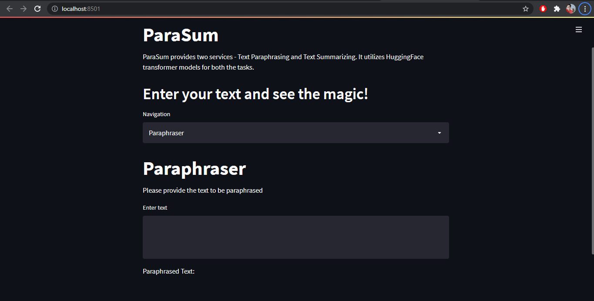

# ParaSum

ParaSum is a web application built using streamlit that performs text paraphrasing and summarization. The transformer models are provided by HuggingFace.

## Installation

* Clone the repository - `git clone https://github.com/mayanktolani19/ParaSum.git`
* Create a new virtual environment - `virtualenv venv`
* Activate the virtual environment - `venv\scripts\activate`
* Install the requirements - `pip install -r requirements.txt`
* Run the app using - `streamlit run main.py`

